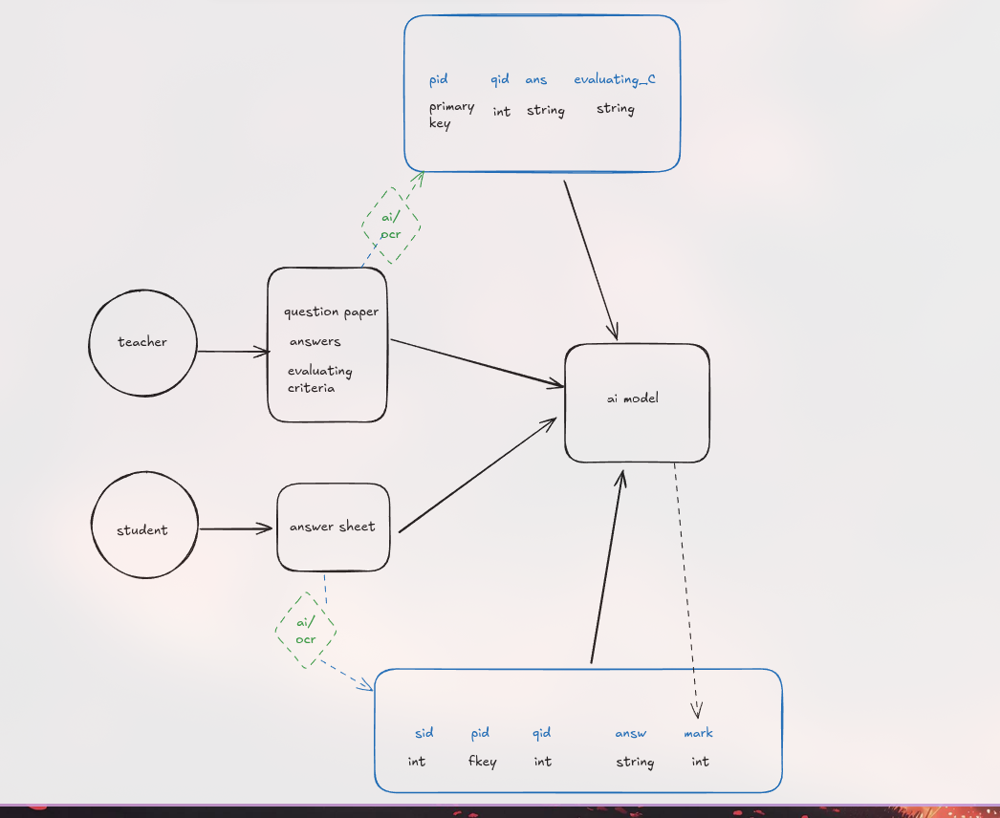

# 📝 AI-Powered Handwritten Answer Sheet Evaluator

An AI-driven platform that automates the manual evaluation of handwritten answer sheets.This system enhances grading accuracy, fairness, and efficiency while offering powerful analytics and feedback capabilities.

## 🚀 Features

- ✍️ **Handwritten Text Recognition** using Google Vision OCR  
- 🧠 **Context-Aware Answer Evaluation** powered by Gemini API (Semantic Analysis)  
- 🔍 **Synonym & Phrase Matching**, Sentence Structure, and Logic Coherence Detection  
- 📷 **Mobile/Web Upload** of Answer Sheets  
- ➕ **Mathematical Expression Parsing**  
- 📊 **Performance Analytics & Adaptive Learning Insights**  
- 📥 **Dynamic Feedback Reports** for Students  
- ☁️ **Cloud-based Infrastructure** with PostgreSQL & Real-time Processing  

## 🖼️ System Architecture

```
User Upload (Web/Mobile) 
      │
      ▼
Preprocessing & Image Cleanup
      │
      ▼
Google Vision OCR → Extract Text
      │
      ▼
Gemini API → Semantic Evaluation
      │
      ▼
Intelligent Grading Logic (Keyword + Context)
      │
      ├─> Math Expression Recognition
      │
      ├─> Feedback Generator
      │
      ▼
Analytics Dashboard + Reports + PostgreSQL Storage
```

## ⚙️ Technologies Used

| Tech                | Purpose                                  |
|---------------------|-------------------------------------------|
| Google Vision OCR   | Handwritten Text Recognition              |
| Gemini API (NLP)    | Semantic Analysis of Answers              |
| PostgreSQL          | Secure Data Storage                       |
| NEXT js    | Backend Server (API & Logic)              |
| NEXT js    | Frontend (Web / Mobile Interfaces)        |
| NEXT js  | RESTful API Layer                         |
|                 |
|      |    |

## 🛠️ Installation & Setup

1. **Clone the Repository**
```bash
git clone https://github.com/AKHIL-DyC/DeepGrade.git

```

2. **Install Dependencies**
```bash
npm install
```

3. **Configure Environment Variables**
```
GOOGLE_VISION_API_KEY=your_key_here
GEMINI_API_KEY=your_key_here
DATABASE_URL=postgres://...
```

4. **Run the app**
```bash
npm run dev
```


## 📄 Example Workflow

1. **Teacher uploads the question paper and evaluation criteria** via the portal.
2. **Student uploads a scanned handwritten answer sheet** through the web or mobile interface.
3. The system performs **OCR** using Google Vision to extract handwritten text.
4. Extracted answers are **contextually evaluated** using Gemini NLP, based on:
   - The uploaded **question paper**
   - The **evaluation criteria**
5. The system assigns marks considering **semantic meaning, sentence structure, synonyms, and logic**.
6. Personalized feedback and performance reports are generated for the student.
7. Educators and admins access detailed analytics to refine the evaluation.




## ✅ Future Improvements

- Voice-to-text feedback for accessibility.  
- Multi-language answer sheet support.  
- Educator AI assistant for instant doubt resolution.  
- AI-based cheating/plagiarism detection.  

## 🤝 Contributing

Pull requests are welcome! For major changes, please open an issue first to discuss what you would like to change.


